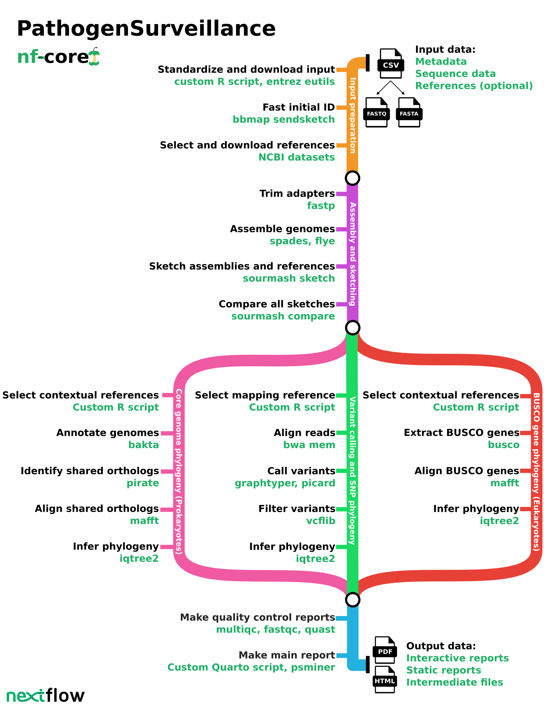

<h1>
  <picture>
    <source media="(prefers-color-scheme: dark)" srcset="docs/images/nf-core-pathogensurveillance_logo_dark.png">
    
  </picture>
</h1>

[](https://github.com/nf-core/pathogensurveillance/actions/workflows/ci.yml)
[](https://github.com/nf-core/pathogensurveillance/actions/workflows/linting.yml)[](https://nf-co.re/pathogensurveillance/results)[](https://doi.org/10.5281/zenodo.XXXXXXX)
[](https://www.nf-test.com)

[](https://www.nextflow.io/)
[](https://docs.conda.io/en/latest/)
[](https://www.docker.com/)
[](https://sylabs.io/docs/)
[](https://cloud.seqera.io/launch?pipeline=https://github.com/nf-core/pathogensurveillance)

[](https://nfcore.slack.com/channels/pathogensurveillance)[](https://twitter.com/nf_core)[](https://mstdn.science/@nf_core)[](https://www.youtube.com/c/nf-core)

## Introduction

**nf-core/pathogensurveillance** is a population genomic pipeline for pathogen diagnosis, variant detection, and biosurveillance.
The pipeline accepts the paths to raw reads for one or more organisms (in the form of a TSV or CSV file) and creates reports in the form of interactive HTML reports or PDF documents.
Significant features include the ability to analyze unidentified eukaryotic and prokaryotic samples, creation of reports for multiple user-defined groupings of samples, automated discovery and downloading of reference assemblies from NCBI RefSeq, and rapid initial identification based on k-mer sketches followed by a more robust core genome phylogeny and SNP-based phylogeny.

The pipeline is built using [Nextflow](https://www.nextflow.io), a workflow tool to run tasks across multiple compute infrastructures in a very portable manner.
It uses Docker/Singularity containers making installation trivial and results highly reproducible.
The [Nextflow DSL2](https://www.nextflow.io/docs/latest/dsl2.html) implementation of this pipeline uses one container per process which makes it much easier to maintain and update software dependencies.
Where possible, these processes have been submitted to and installed from [nf-core/modules](https://github.com/nf-core/modules) in order to make them available to all nf-core pipelines, and to everyone within the Nextflow community!

<!-- TODO nf-core: Add full-sized test dataset and amend the paragraph below if applicable -->

On release, automated continuous integration tests run the pipeline on a full-sized dataset on the AWS cloud infrastructure.
This ensures that the pipeline runs on AWS, has sensible resource allocation defaults set to run on real-world data sets, and permits the persistent storage of results to benchmark between pipeline releases and other analysis sources.The results obtained from the full-sized test can be viewed on the [nf-core website](https://nf-co.re/pathogensurveillance/results).

## Pipeline summary



## Usage

> [!NOTE]
> If you are new to Nextflow and nf-core, please refer to [this page](https://nf-co.re/docs/usage/installation) on how to set-up Nextflow. Make sure to [test your setup](https://nf-co.re/docs/usage/introduction#how-to-run-a-pipeline) with `-profile test` before running the workflow on actual data.

First, prepare a samplesheet with your input data that looks as follows:

```bash
nextflow run nf-core/pathogensurveillance -r dev -profile RUN_TOOL,xanthomonas_small -resume --out_dir test_output
```

Note that some form of configuration will be needed so that Nextflow knows how to fetch the required software. This is usually done in the form of a config profile (`RUN_TOOL` in the example command above). You can chain multiple config profiles in a comma-separated string.

> - The pipeline comes with config profiles called `docker`, `singularity`, `podman`, `shifter`, `charliecloud` and `conda` which instruct the pipeline to use the named tool for software management. For example, `-profile xanthomonas_small,docker`.
> - Please check [nf-core/configs](https://github.com/nf-core/configs#documentation) to see if a custom config file to run nf-core pipelines already exists for your Institute. If so, you can simply use `-profile <institute>` in your command. This will enable either `docker` or `singularity` and set the appropriate execution settings for your local compute environment.
> - If you are using `singularity`, please use the [`nf-core download`](https://nf-co.re/tools/#downloading-pipelines-for-offline-use) command to download images first, before running the pipeline. Setting the [`NXF_SINGULARITY_CACHEDIR` or `singularity.cacheDir`](https://www.nextflow.io/docs/latest/singularity.html?#singularity-docker-hub) Nextflow options enables you to store and re-use the images from a central location for future pipeline runs.
> - If you are using `conda`, it is highly recommended to use the [`NXF_CONDA_CACHEDIR` or `conda.cacheDir`](https://www.nextflow.io/docs/latest/conda.html) settings to store the environments in a central location for future pipeline runs.

-->

Now, you can run the pipeline using:

```bash
nextflow run nf-core/pathogensurveillance -r dev -profile RUN_TOOL -resume --sample_data <TSV/CSV> --out_dir <OUTDIR> --download_bakta_db
```

```bash
nextflow run nf-core/pathogensurveillance \
   -profile <docker/singularity/.../institute> \
   --input samplesheet.tsv \
   --outdir <OUTDIR>
```

## Documentation

For more details and further functionality, please refer to the [usage documentation](https://nf-co.re/pathogensurveillance/usage) and the [parameter documentation](https://nf-co.re/pathogensurveillance/parameters).

Documentation is currently under development, but can be found here:

https://grunwaldlab.github.io/pathogensurveillance_documentation

### Input format

The primary input to the pipeline is one or more TSV (tab-separated value) or CSV (comma comma-separated value) file, specified using the `--input` option.
These can be made in a spreadsheet program like [LibreOffice Calc](https://www.libreoffice.org/) or Microsoft Excel by exporting to TSV/CSV.
Each of these input tables have the same input format requirements, but different types of data can be stored in different inputs for the user's convenience, see the "Using multiple input tables" section below for more details.

#### Format flexiblity

Columns can be in any order and unused columns can be left out or left blank.
Column names and values for categorical columns (e.g. `data_type`) are case insensitive and spaces and dashes are equivalent to underscores.
Any columns not recognized by `pathogensurveillance` will be ignored, allowing users to adapt existing sample metadata tables by adding or renaming columns.

#### Required inputs

This pipeline is designed to be useful with minimal inputs.
Only the `data_type` and `data_source` columns are needed for `sample` or `reference` input types, but ideally the `id`, `name`,  `report_id`, and `ploidy` (when applicable) are specified as well.
The `sample metadata` and `reference metadata` input types do not require any particular columns, by will be ignored if they do nay have relevant metadata in at least one column.

#### Possible inputs

Below is a description of each column used by `pathogensurveillance`:

- **id**: The unique identifier for each sample/reference. This will be used in file names to distinguish samples/references in the output. Each ID can be used multiple times to indicate that multiple types of data are associated with a given sample and the same input data can be used by different IDs. However, not all combinations of input data types are supported. Any values supplied that that cannot appear in file names (\/:\*?"<>| .) will be modified automatically. If not supplied, it will be assumed that each row is a separate sample and the ID will be derived from the `data_type` and `data_source` columns.
- **ref_group_id**: One or more reference group IDs separated by ";". These are used to supply specific references to specific samples. For references, these indicate which reference group a reference is a part of and for samples these indicate which reference group to use for the sample. For samples, the value in the `id` column of a reference can also be used.
- **report_id**: How to group samples into reports. For every unique value in this column a report will be generated. Samples can be assigned to multiple reports by separating group IDs by `;`. For example `all;subset` will put the sample in both `all` and `subset` report groups. Samples will be added to a default group if this is not supplied.
- **name**: A short human-readable label that is used in plots and tables. If not supplied, it will be inferred from `id`.
- **description**: A longer human-readable label that is used in plots and tables. If not supplied, it will be inferred from `name`.*
- **input_type**: Controls how the pipeline uses this input, particularly whether the input is a "sample" that should be identified and tracked or a "reference" that should be used when useful to provide context to samples. Can accept the following values:
    - `sample` (default): These are inputs you want more information about. The pipeline will analyze the data in `data_type` and `data_source` as well as any metadata available in other columns to try to identify and analyze the sample.
    - `reference`: These are "known" inputs. The pipeline will use the data in `data_type` and `data_source` as well as any metadata available in other columns to provide context to samples or aid in the analysis of sample data.
    - `sample metadata`: Like `sample`, but only metadata such as `location` and `time` will be used.
    - `reference metadata`: Like `reference`, but only metadata such as `location` and `time` will be used.
- **data_type**: What the type of the data in `data_source` is. Can be any of the following:
    - `Illumina`: Illumina sequence data reads supplied as file paths to local FASTQ files or URLs. The two files from paired end sequencing can be defined by separating their paths with `;`.
    - `Nanopore`: Nanopore sequence data reads supplied as file paths to local FASTQ files or URLs. 
    - `Pacbio`: Pacbio sequence data reads supplied as file paths to local FASTQ files or URLs.
    - `Assembly`: Genome assemblies 
    - `NCBI accession`: A SRA, assembly, or biosample accession.
    - `NCBI SRA query`: A query to the NCBI Short Read Archive (SRA). All values matching the query will be downloaded and used. Beware, this can be an impractical amount of results. The maximum number of values returned can be controlled with the `query_max` column.
    - `NCBI assembly query`: A query to the NCBI assembly database. All values matching the query will be downloaded and used. Beware, this can be an impractical amount of results. The maximum number of values returned can be controlled with the `query_max` column.
    - `image`: A photograph or other image. 
- **data_source**: The value identifying the data to be used, such as file paths, URLs, or database IDs, as defined by the `data_type` column.
- **enabled**: Either "TRUE" or "FALSE", indicating whether the sample should be included in the analysis or not. Defaults to "TRUE".
- **ref_primary_usage**: Controls how the reference is used in the analysis in cases where a single "best" reference is required, such as for variant calling. Can be one of "optional" (can be used if selected by the analysis), "required" (will always be used), "exclusive" (only those marked "exclusive" will be used), or "excluded" (will not be used).
- **ref_contextual_usage**: Controls how the reference is used in the analysis in cases where multiple references are required to provide context for the samples, such as for phylogeny. Can be one of "optional" (can be used if selected by the analysis), "required" (will always be used), "exclusive" (only those marked "exclusive" will be used), or "excluded" (will not be used).
- **color_by**: The names of other columns that contain values used to color samples in plots and figures in the report. Multiple column names can be separated by ";". Specified columns can contain either categorical factors or specific colors, specified as a hex code. By default, samples will be one color and references another.
- **ploidy**: The ploidy of the sample. Should be a number. Defaults to "1".
- **latitude**: The latitude associated with a sample in decimal degrees (e.g. '40.446').
- **longitude**: The longitude associated with a sample in decimal degrees (e.g. '-79.982').
- **location**: An address, place name of a geographical location, or coordinates associated with the sample. Address components should be separated by commas and can contain arbitrary numbers of components (e.g. 'street, city/town, county, state, region, country' or 'city, state, country' or just 'country'). Used to infer values for the `latitude` and `longitude` columns if they are not supplied. If `latitude` and `longitude` are supplied, the value of this column will be inferred.
- **country**: The country a sample was found in.
- **region**: The part of a country a sample was found in, for example a state in the United States.
- **subregion**: A smaller region within a larger region of a country, for example a county in the United States.
- **place**: A city, town, village, park, or other notable point.
- **district**: A part of a `place`, such as a neighborhood or city district.
- **date**: The date and optionally time associated with an input. Used to populate the `year`, `month`, `day`, `hour`, `minute`, and `second` columns if not supplied. Smaller time increments, such as seconds, can be omitted but large time increments must be present if smaller time increments are present. The year component of dates must include 4 digits (for example `2024`)For example, `March 21` would not be valid since it does not include the year. Most common data/time formats are supported.
- **year**: The year with 4 digits (For example `2024`)
- **month**: The month of year, either a number, abbreviation, or full name.
- **day**: The day of the month as a number.
- **hour**: The hour of a 24 hour clock or a 12 hour clock with am/pm (For example `13` and `1pm` are the same)
- **minute**: The minute of an hour, between 0 and 60.
- **second**: The seconds in an hour, between 0 and 60.
- **link**: One or more links associated with the input, separated by `;`.

Additionally, users can supply a dedicated reference metadata TSV/CSV using the `--reference_data` option.
The reference metadata TSV or the sample metadata TSV can have any of the columns documented above.

#### Disallowed columns

There are also a few columns that the pipeline uses internally and these **cannot be supplied by the user**:

- **_row_index_**: Used to store the original row an input was on, primarily for error reporting.
- **_input_path_**: Used to store the original file an input was from, primarily for error reporting.

#### Using multiple input tables

All input tables are combined into a single table, but each input table can have different subsets of supported columns or user-specific custom columns.
This can be useful if you are adapting multiple existing tables or want to have separate tables for different types of data.
For example, one table can contain paths to sequence data as `sample` input types while another has GPS coordinates with `sample metadata` input types.
Or, you could have all `reference` input data types in one table and all `sample` inputs in another.
Using different tables to store data for the same samples requires that they share the same value in the `id` column.

## Credits

nf-core/pathogensurveillance was originally written by Zachary S.L. Foster, Camilo Parada-Rojas, Logan Blair, Martha Sudermann, Nicholas C. Cauldron, Fernanda I. Bocardo, Ricardo Alcalá-Briseño, Hung Phan, Jeff H. Chang, Niklaus J. Grünwald

To see the results of an example test run with a full size dataset refer to the [results](https://nf-co.re/pathogensurveillance/results) tab on the nf-core website pipeline page.
For more details about the output files and reports, please refer to the
[output documentation](https://nf-co.re/pathogensurveillance/output).

## Credits

nf-core/pathogensurveillance was originally written by Zachary S.L. Foster, Martha Sudermann, Nicholas C. Cauldron, Fernanda I. Bocardo, Hung Phan, Jeff H. Chang, Niklaus J. Grünwald.

## Contributions and Support

If you would like to contribute to this pipeline, please see the [contributing guidelines](.github/CONTRIBUTING.md).

For further information or help, don't hesitate to get in touch on the [Slack `#pathogensurveillance` channel](https://nfcore.slack.com/channels/pathogensurveillance) (you can join with [this invite](https://nf-co.re/join/slack)).

## Citations

<!-- TODO nf-core: Add citation for pipeline after first release. Uncomment lines below and update Zenodo doi and badge at the top of this file. -->
<!-- If you use nf-core/pathogensurveillance for your analysis, please cite it using the following doi: [10.5281/zenodo.XXXXXX](https://doi.org/10.5281/zenodo.XXXXXX) -->

<!-- TODO nf-core: Add bibliography of tools and data used in your pipeline -->

An extensive list of references for the tools used by the pipeline can be found in the [`CITATIONS.md`](CITATIONS.md) file.

You can cite the `nf-core` publication as follows:

> **The nf-core framework for community-curated bioinformatics pipelines.**
>
> Philip Ewels, Alexander Peltzer, Sven Fillinger, Harshil Patel, Johannes Alneberg, Andreas Wilm, Maxime Ulysse Garcia, Paolo Di Tommaso & Sven Nahnsen.
>
> _Nat Biotechnol._ 2020 Feb 13. doi: [10.1038/s41587-020-0439-x](https://dx.doi.org/10.1038/s41587-020-0439-x).
