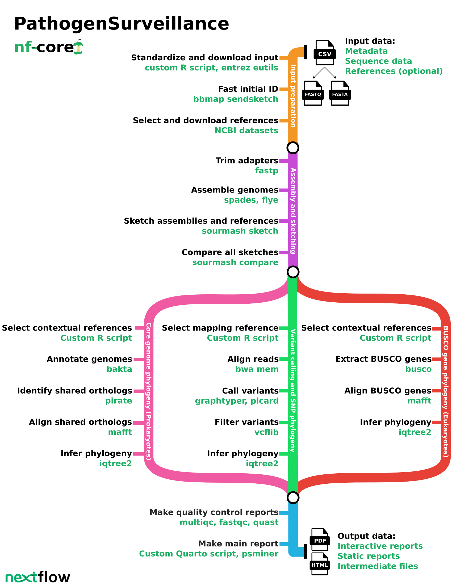

<picture> <source media="(prefers-color-scheme: dark)" srcset="docs/images/nf-core-pathogensurveillance_logo_dark.png"> <source media="(prefers-color-scheme: light)" srcset="docs/images/nf-core-pathogensurveillance_logo_light.png">  </picture>

[](https://nf-co.re/pathogensurveillance/results)[](https://doi.org/10.5281/zenodo.XXXXXXX)

[](https://www.nextflow.io/) [](https://docs.conda.io/en/latest/) [](https://www.docker.com/) [](https://sylabs.io/docs/) [](https://tower.nf/launch?pipeline=https://github.com/nf-core/pathogensurveillance)

[](https://nfcore.slack.com/channels/pathogensurveillance)[](https://twitter.com/nf_core)[](https://www.youtube.com/c/nf-core)

## NOTE: THIS PROJECT IS UNDER DEVELOPMENT AND MAY NOT FUNCTION AS EXPECTED UNTIL THIS MESSAGE GOES AWAY

## Table of Contents

-   [Introduction](#introduction)
-   [Pipeline Summary](#pipelinesummary)
-   [Flowchart](#flowchart)
-   [Quick Start](#quickstart)
-   [Documentation](#documentation)
-   [Example Run](#examplerun)
-   [Benchmarks](#benchmarks)
-   [Credits](#credits)
-   [Contributions and Support](#contributionsandsupport)
-   [Citations](#citations)

## Introduction {#introduction}

<!-- TODO nf-core: Write a 1-2 sentence summary of what data the pipeline is for and what it does -->

**nf-core/pathogensurveillance** is a population genomic pipeline for pathogen diagnosis, variant detection, and biosurveillance.
The pipeline accepts the paths to raw reads for one or more organisms (in the form of a CSV file) and creates reports in the form of interactive HTML reports or PDF documents.
Significant features include the ability to analyze unidentified eukaryotic and prokaryotic samples, creation of reports for multiple user-defined groupings of samples, automated discovery and downloading of reference assemblies from NCBI RefSeq, and rapid initial identification based on k-mer sketches followed by a more robust core genome phylogeny and SNP-based phylogeny.

The pipeline is built using [Nextflow](https://www.nextflow.io), a workflow tool to run tasks across multiple compute infrastructures in a very portable manner.
It uses Docker/Singularity containers making installation trivial and results highly reproducible.
The [Nextflow DSL2](https://www.nextflow.io/docs/latest/dsl2.html) implementation of this pipeline uses one container per process which makes it much easier to maintain and update software dependencies.
Where possible, these processes have been submitted to and installed from [nf-core/modules](https://github.com/nf-core/modules) in order to make them available to all nf-core pipelines, and to everyone within the Nextflow community!

<!-- TODO nf-core: Add full-sized test dataset and amend the paragraph below if applicable -->

On release, automated continuous integration tests run the pipeline on a full-sized dataset on the AWS cloud infrastructure.
This ensures that the pipeline runs on AWS, has sensible resource allocation defaults set to run on real-world data sets, and permits the persistent storage of results to benchmark between pipeline releases and other analysis sources.The results obtained from the full-sized test can be viewed on the [nf-core website](https://nf-co.re/pathogensurveillance/results).

## Pipeline summary {#pipelinesummary}

-   Download sequences and references if they are not provided locally
-   Quickly obtain several initial sample references (`bbmap`)
-   More accurately select appropriate reference genomes. Genome "sketches" are compared between first-pass references, samples, and any references directly provided by the user (`sourmash`)
-   Genome assembly
    -   Illumina shortreads: (`spades`)
    -   Pacbio or Oxford Nanopore longreads: (`flye`)
-   Genome annotation (`bakta`)
-   Align reads to reference sequences (`bwa`)
-   Variant calling and filtering (`graphtyper`, `vcflib`)
-   Determine relationship between samples and references
    -   Build SNP tree from variant calls (`iqtree`)
    -   For Prokaryotes:
        -   Identify shared orthologs (`pirate`)
        -   Build tree from core genome phylogeny (`iqtree`)
    -   For Eukaryotes:
        -   Identify BUSCO genes (`busco`)
        -   Build tree from BUSCO genes (`read2tree`)
-   Generate interactive html report/pdf file
    -   Sequence and assembly information (`fastqc, multiqc, quast`)
    -   sample identification tables and heatmaps
    -   Phylogenetic trees from genome-wide SNPs and core genes
    -   minimum spanning network

## Flowchart {#flowchart}



## Quick Start {#quickstart}

1.  Install [`Nextflow`](https://www.nextflow.io/docs/latest/getstarted.html#installation) (`>=21.10.3`)

2.  Install any of [`Docker`](https://docs.docker.com/engine/installation/), [`Singularity`](https://www.sylabs.io/guides/3.0/user-guide/) (you can follow [this tutorial](https://singularity-tutorial.github.io/01-installation/)), [`Podman`](https://podman.io/), [`Shifter`](https://nersc.gitlab.io/development/shifter/how-to-use/) or [`Charliecloud`](https://hpc.github.io/charliecloud/) for full pipeline reproducibility *(you can use [`Conda`](https://conda.io/miniconda.html) both to install Nextflow itself and also to manage software within pipelines. Please only use it within pipelines as a last resort; see [docs](https://nf-co.re/usage/configuration#basic-configuration-profiles))*.

3.  Download the pipeline and test it on a minimal dataset with a single command:

    ``` bash
    nextflow run nf-core/pathogensurveillance -profile test,YOURPROFILE --outdir <OUTDIR> -resume
    ```

    Note that some form of configuration will be needed so that Nextflow knows how to fetch the required software.
    This is usually done in the form of a config profile (`YOURPROFILE` in the example command above).
    You can chain multiple config profiles in a comma-separated string.

    > -   The pipeline comes with config profiles called `docker`, `singularity`, `podman`, `shifter`, `charliecloud` and `conda` which instruct the pipeline to use the named tool for software management. For example, `-profile test,docker`.
    > -   Please check [nf-core/configs](https://github.com/nf-core/configs#documentation) to see if a custom config file to run nf-core pipelines already exists for your Institute. If so, you can simply use `-profile <institute>` in your command. This will enable either `docker` or `singularity` and set the appropriate execution settings for your local compute environment.
    > -   If you are using `singularity`, please use the [`nf-core download`](https://nf-co.re/tools/#downloading-pipelines-for-offline-use) command to download images first, before running the pipeline. Setting the [`NXF_SINGULARITY_CACHEDIR` or `singularity.cacheDir`](https://www.nextflow.io/docs/latest/singularity.html?#singularity-docker-hub) Nextflow options enables you to store and re-use the images from a central location for future pipeline runs.
    > -   If you are using `conda`, it is highly recommended to use the [`NXF_CONDA_CACHEDIR` or `conda.cacheDir`](https://www.nextflow.io/docs/latest/conda.html) settings to store the environments in a central location for future pipeline runs.

4.  Start running your own analysis!

    <!-- TODO nf-core: Update the example "typical command" below used to run the pipeline -->

    ``` bash
    nextflow run nf-core/pathogensurveillance --input samplesheet.csv --outdir <OUTDIR> -profile <docker/singularity/podman/shifter/charliecloud/conda/institute> -resume
    ```

You can also try running a small example dataset hosted with the source code using the following command (no need to download anything):

```         
nextflow run nf-core/pathogensurveillance --input https://raw.githubusercontent.com/grunwaldlab/pathogensurveillance/master/test/data/metadata_small.csv --outdir test_out --download_bakta_db true -profile docker -resume
```

## Documentation {#documentation}

The nf-core/pathogensurveillance pipeline comes with documentation about the pipeline [usage](https://nf-co.re/pathogensurveillance/usage), [parameters](https://nf-co.re/pathogensurveillance/parameters) and [output](https://nf-co.re/pathogensurveillance/output).

### Input format

The primary input to the pipeline is a CSV (comma comma-separated value).
Columns can be in any order and unneeded columns can be left out or left blank.
Only a single column containing paths to raw sequence data or SRA (Sequence Read Archive) accessions is required and each sample can have values in different columns.
Any columns not recognized by `pathogensurveillance` will be ignored, allowing users to adapt existing sample metadata table by adding new columns.
Below is a description of each column used by `pathogensurveillance`:

-   **sample_id**: The unique identifier for each sample. This will be used in file names to distinguish samples in the output. Each sample ID must correspond to a single set of sequence data (The `shortread_*`, `nanopore`, and `sra` columns), although the same sequence data can be used by multiple different IDs. Any values that correspond to multiple different sets of sequence data or contain characters that cannot appear in file names (/:\*?"\<\>\| .) will be modified automatically. If not supplied, it will be inferred from the names of input data.
-   **sample_name**: A human-readable label for the sample that is used in plots and tables. If not supplied, it will be inferred from the names of `sample_id`.
-   **shortread_1**: Path to short read FASTQs like that produced by Illumina. When paired end sequencing is used, this is used for the forward read's data. This can be a local file path or a URL to an online location.
-   **shortread_2**: Path to short read FASTQs like that produced by Illumina. This is used for the reverse read's data when paired-end sequencing is used. This can be a local file path or a URL to an online location.
-   **nanopore**: Path to nanopore FASTQs. This can be a local file path or a URL to an online location.
-   **pacbio**: Path to pacbio FASTQs. This can be a local file path or a URL to an online location.
-   **sra**: Sequence Read Archive (SRA) accession numbers. These will be automatically downloaded and used as input.
-   **reference_id**: The unique identifier for each user-defined reference genome. This will be used in file names to distinguish samples in the output. Each reference ID must correspond to a single set of reference data (The `reference` and `reference_refseq` columns), although the same reference data can be used by multiple different IDs. Any values that correspond to multiple different sets of reference data or contain characters that cannot appear in file names (/:\*?"\<\>\| .) will be modified automatically. If not supplied, it will be inferred from the names of reference genomes.
-   **reference_name**: A human-readable label for user-defined reference genomes that is used in plots and tables. If not supplied, it will be inferred from the names of reference_id.
-   **reference**: Path to user-defined reference genomes for each sample. This can be a local file path or a URL to an online location.
-   **reference_refseq**: RefSeq accession ID for a user-defined reference genome. These will be automatically downloaded and used as input.
-   **report_group**: How to group samples into reports. For every unique value in this column a report will be generated. Samples can be assigned to multiple reports by separating group IDs by `;`. For example `all;subset` will put the sample in both `all` and `subset` report groups. If not included, all samples will be
-   **color_by**: The names of user-specific columns (not usually any of the ones described here) containing variables to base the color of some plots by (e.g. the minimum spanning network). If not included, plots will not be colored.

### Command-line options

**Required:**

-   `--input`: Path to comma-separated file containing information about the samples in the experiment.

-   `--output`: The output directory where the results will be saved.
    You have to use absolute paths to storage on Cloud infrastructure.

-   `--bakta_db`: The path to the Bakta database folder.
    This or `--download_bakta_db` must be included.

-   `--download_bakta_db`: Download the database required for running Bakta.
    Note that this will download gigabytes of information, so if you plan on running the pipeline repeatedly it would be better to download the database manually and specify the path with `--bakta_db`

**Nextflow Options:**

-   `-profile`: Instructs the pipeline to use the named tool for software management. `docker`, `singularity`, `podman`, `shifter`, `charliecloud` and `conda`. For example, `-profile test,docker`
-   `-resume`: Restarts an incomplete run by using cached intermediate files.

**Optional:**

-   `--email`: Set this parameter to your e-mail address to get a summary e-mail with details of the run sent to you when the workflow exits.
    If set in your user config file (\`\~/.nextflow/config\`) then you don't need to specify this on the command line for every run.

-   `--multiqc_title`: MultiQC report title.
    Printed as page header, used for filename if not otherwise specified.

**Performance Parameters:**

-   `--max_cpus`: Maximum number of CPUs that can be requested for any single job.
    Default: `16`

-   `--max_memory`: Maximum amount of memory that can be requested for any single job.
    Default: `128.GB`

-   `--max_time`: Maximum amount of time that can be requested for any single job.
    Default: `240.h`

**Analysis Parameters:**

-   `--sketch_max_depth`: Depth reads are subsampled to for the initial sketch-based identification.
    Default: `3`

-   `--variant_max_depth`: Depth reads are subsampled to for the variant-based parts of the analysis.
    Default: `15`

-   `--assembly_max_depth`: Depth reads are subsampled to for genome assembly.
    This will be multiplied by the predicted ploidy of each sample.
    Default: `30`

-   `--refseq_download_num`: The maximum number of RefSeq sequences to select and download for each sample at each taxonomic level (species, genus, and family).
    The total number will vary based on the diversity of samples.
    Default: `10`

-   `--min_core_genes`: The minimum number of genes needed to conduct a core gene phylogeny.
    Samples and references will be removed (as allowed by the `min_core_samps` and `min_core_refs` options) until this minimum is met Default: `10`

-   `--min_core_samps`: The minimum proportion of samples needed to conduct a core gene phylogeny.
    Samples will be removed until the `min_core_genes` option is satisfied or this minimum is met.
    Default: `0.8`

-   `--min_core_refs`: The minimum proportion of references needed to conduct a core gene phylogeny.
    References will be removed until the `min_core_genes` option is satisfied or this minimum is met.
    Default: `0.5`

-   `--max_core_genes`: The maximum number of genes used to conduct a core gene phylogeny.
    Default: `100`

-   `--min_ref_ani`: The minimum ANI between a sample and potential reference for that reference to be used for variant calling with that sample.
    To force all the samples in a report group to use the same reference, set this value very low.
    Default: `0.9`

-   `--publish_dir_mode`: Method used to save pipeline results to output directory.

    -   `copy`: Default mode. The output of each process is copied from the work directory into the output directory. This caching allows for each intermediate file to be easily accessed by the user and for the pipeline to resume if it encounters an error in a later process.
    -   `link`: Alternative option if storage space is an issue. No files will be copied into the output directory, but files are still accessible through hard links to their storage locations in the work directory. Caching is still enabled, but care must be taken to retrieve desired files from the work directory before it is cleared.

## Example Run {#examplerun}

This example uses a subset of the data described in Bryant et al. 2016:

> **Emergence and spread of a human-transmissible multidrug-resistant nontuberculous mycobacterium** doi: [DOI: 10.1126/science.aaf8156](https://doi.org/10.1126/science.aaf8156).

The data comes from isolated cultures of *Mycobacterium abscessus*, taken from three different individuals with drug-resistant infections.
For the sake of this example, we'll pretend that the pathogen is unknown and use the pipeline to help make that determination.
We'll also explore how isolates relate with respect to each other, as well as to the reference sequences of other closely-related organisms.
This information can be obtained from several plots that the pipeline generates automatically.

### Sample input

Here is a look at the first few lines of "mycobacterium_tutorial.csv", which serves as the pipeline's only unique input file:

| SRA         | reference_refseq |
|-------------|------------------|
| SRR12574846 | GCF_017189435.1  |
| SRR12574847 | GCF_017189435.1  |
| SRR12574848 | GCF_017189435.1  |

-   The "SRA" column tells Pathogensurveilance which SRA accessions to download.
    Each row corresponds to one individual sample.
    In this case, the samples are paired-end illumina shortreads, but the pipeline will also work with mixed inputs of Pacbio or Oxford Nanopore.

-   For your own analysis, sequence files may instead be present locally.
    You'll need to provide the path to each file in the CSV, and each path will need to be placed in the "shortread_1/shortread_2" columns instead of the SRA column.

-   The "reference_refseq" column is optional.
    Here, it will tell the pipeline to download and try to use the "GCF_017189435.1" reference even if there may be "closer" matches.
    This option may be useful when you are relatively confident as to the species identity of your input sequences, have a good idea of the best reference for this species, and are working within a clade that is densely populated with other references.

### Running the pipeline

Here is the full command used execute this example, using a docker container:

`nextflow run nf-core/pathogensurveillance --input [https://raw.githubusercontent.com/grunwaldlab/pathogensurveillance/master/test/data/metadata](https://raw.githubusercontent.com/grunwaldlab/pathogensurveillance/master/test/data/metadata_small.csv){.uri}[/mycobaterium_tutorial.csv](https://raw.githubusercontent.com/grunwaldlab/pathogensurveillance/master/test/data/metadata/mycobaterium_tutorial.csv) --outdir mycobacterium_small_out --download_bakta_db true -profile docker -resume --max_cpus 8 --max_memory 31GB -resume`

-   The mycobacterium_tutorial.csv file is hosted on github.
    When running your own analysis, you will need to provide your own path to the input CSV file.

-   By default, the pipeline will run on 128 GB of RAM and 16 threads.
    This is more resources than is strictly necessary and beyond the capacity of most desktop computers.
    We can scale this back a bit for this lightweight test run.
    This analysis will work with 8 threads and 31 GB of RAM (albeit more slowly), which is specified by the --max_cpus and --max_memory settings.

-   The setting `-resume` is only necessary when resuming a previous analysis.
    However, it doesn't hurt to include it at the start.
    If the pipeline were to be interrupted, this allows it to pick up where it left off as long as the previous command is executed from the same working directory.

If the pipeline begins successfully, you should see a screen tracking your progress:

`[25/63dcee] process > PATHOGENSURVEILLANCE:INPUT_CHECK:SAMPLESHEET_CHECK (my.csv)[100%] 1 of 1`

``` [-        ] process > PATHOGENSURVEILLANCE:SRATOOLS_FASTERQDUMP``0 of 9 ```

`[-        ] process > PATHOGENSURVEILLANCE:DOWNLOAD_ASSEMBLIES                               -`

`[-        ] process > PATHOGENSURVEILLANCE:SEQKIT_SLIDING                                    -`

`[-        ] process > PATHOGENSURVEILLANCE:FASTQC                                            -`

`[-        ] process > PATHOGENSURVEILLANCE:COARSE_SAMPLE_TAXONOMY:BBMAP_SENDSKETCH           -`

This run has currently finished checking the sample inputs and is downloading the associated reads from the SRA.
The input and output of each process can be accessed from the work/ directory.
The subdirectory within work/ is designated by the string to left of each step.
Note that this location will be different each time the pipeline is run, and only the first part of the name of the subdirectory is shown.
For this run, we could navigate to `work/25/63dcee(etc)` to access the input csv that is used for the next step.

### Report

You should see this message if the pipeline finishes successfully:

\<example\>

The final report can be viewed as either a .pdf or .html file.
It can be accessed inside the reports folder of the output directory (here: `mycobacteroides_small_out/reports`).
This report shows several key pieces of information about your samples.

This particular report has been included as an example under `test/sample_reports/mycobacteroides_small`.

**Summary:**

-   **Pipeline Status Report**: error messages for samples or sample groups
-   **Input Data**: Data read from the input .csv file

**Identification:**

-   **Initial identification**: Coarse identification from the bbmap sendsketch step. The first tab shows best species ID for each sample*.* The second tab shows similarity metrics between sample sequences and other reference genomes: %ANI (average nucleotide identity), %WKID (weighted kmer identity), and %completeness.
    -   Each of these samples have top hits to different subspecies/isolates of *Mycobacteroides abscessus.*

    -   For more information about each metric, click the **About this table** tab underneath.
-   **Most similar organisms**: Shows relationships between samples and references using % ani and % pocp (percentage of conserved proteins). For better resolution, you can interactively zoom in/out of plots.
    -   The species *Mycobacteroides abscessus* is well-studied, and you can see a pretty high density of reference sequences for this organism. Our three samples have good hits to quite a few of these references. At the subspecies level, samples SRR12574847 and SRR12574848 have subspecies *absessus* as their top match, whereas sample SRR12574846 is a better match to subspecies *massiliense*.
-   **Phylogenetic context**: This is a more robust tree showing the evolutionary relationships both among strains and between different reference genomes. Methods to generate this tree differ between prokaryotes and eukaryotes. Our input to the pipeline was prokaryotic DNA sequences, and the method to build this tree is based upon many different core genes shared between samples and references (for eukaryotes, this is constrained to BUSCO genes). This tree is built with iqtree and based upon shared core genes analyzed using the program pirate. You can highlight branches by hovering over and clicking on nodes.
    -   Based on this tree, we can again see that samples SRR12574847 and SRR12574848 are more closely related than sample SRR12574846.
    -   One point discussed in Bryant et al. 2016 is that some of these drug-resistant samples have deep branches with respect to other references. For instance, note the relatively unique placement of SRR12574846. In the paper, this type of pattern is interpreted as the independent acquisition of unrelated environmental bacteria.

**Genetic Diversity**

-   **Core gene phylogeny**: Tree based on single nucleotide polymorphisms (SNPs).
    This tree shows genetic relationships among samples, in comparison to a single reference assembly.
    This tree is built with the program iqtree and based on the VCF file generated from all available samples.

    This tree is better suited for visualizing the genetic diversity among samples.
    However, the phylogenetic context tree provides a much better source of information for evolutionary differences among samples and other known references.

    -   The reference *Mycobacteroides abscessus subsp. abscessus* was chosen to be the reference sequence for generating the VCF file. Like in the phylogenetic context tree, samples SRR12574847 and SRR12574848 are more closely related than sample SRR12574846.
    -   In this case, there is a slight discordance between the tree and %ANI. Samples SRR12574847 and SRR12574848 are more closely related to *Mycobacteroides abscessus subsp. abscessus* than sample SRR12574846. But in terms of %ANI, sample SRR12574846 has a slightly better % match to this reference. In these cases, the core genome phylogeny is probably a better metric for sample classification.

-   **Minimum spanning network**: The nodes represent unique multilocus genotypes, and the size of nodes is proportional to the \# number of samples that share the same genotype.
    The edges represent the SNP differences between two given genotypes, and the darker the color of the edges, the fewer SNP differences between the two.

**References**

-   Information about pipeline commands, software versions, and R packages to run analysis are presented here, along with other pipeline references and information about contributors.

## Benchmarks {#benchmarks}

## Credits {#credits}

nf-core/pathogensurveillance was originally written by Zachary S.L. Foster, Martha Sudermann, Nicholas C. Cauldron, Fernanda I. Bocardo, Hung Phan, Jeff H. Chang, Niklaus J. Grünwald.

We thank the following people for their extensive assistance in the development of this pipeline:

<!-- TODO nf-core: If applicable, make list of people who have also contributed -->

## Contributions and Support {#contributionsandsupport}

If you would like to contribute to this pipeline, please see the [contributing guidelines](.github/CONTRIBUTING.md).

For further information or help, don't hesitate to get in touch on the [Slack `#pathogensurveillance` channel](https://nfcore.slack.com/channels/pathogensurveillance) (you can join with [this invite](https://nf-co.re/join/slack)).

## Citations {#citations}

<!-- TODO nf-core: Add citation for pipeline after first release. Uncomment lines below and update Zenodo doi and badge at the top of this file. -->

<!-- If you use  nf-core/pathogensurveillance for your analysis, please cite it using the following doi: [10.5281/zenodo.XXXXXX](https://doi.org/10.5281/zenodo.XXXXXX) -->

<!-- TODO nf-core: Add bibliography of tools and data used in your pipeline -->

An extensive list of references for the tools used by the pipeline can be found in the [`CITATIONS.md`](CITATIONS.md) file.

You can cite the `nf-core` publication as follows:

> **The nf-core framework for community-curated bioinformatics pipelines.**
>
> Philip Ewels, Alexander Peltzer, Sven Fillinger, Harshil Patel, Johannes Alneberg, Andreas Wilm, Maxime Ulysse Garcia, Paolo Di Tommaso & Sven Nahnsen.
>
> *Nat Biotechnol.* 2020 Feb 13.
> doi: [10.1038/s41587-020-0439-x](https://dx.doi.org/10.1038/s41587-020-0439-x).
